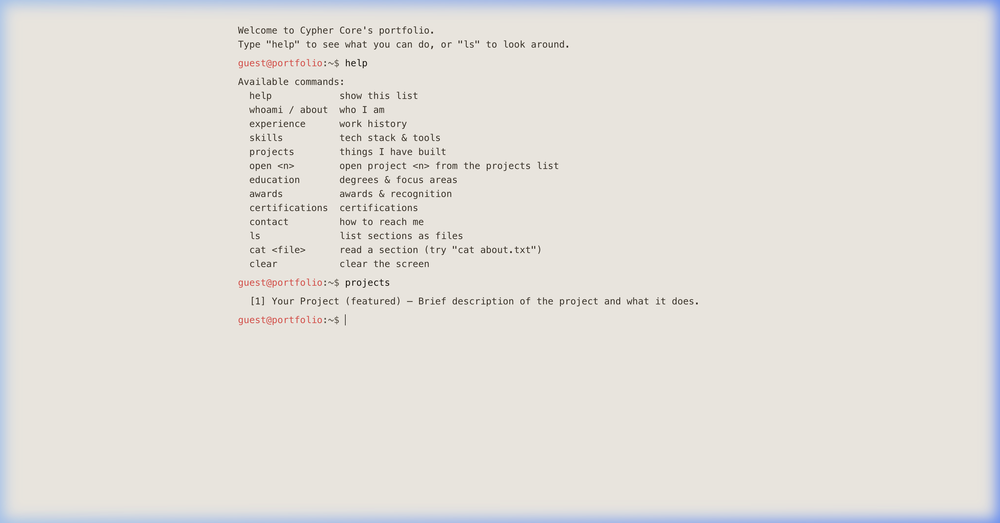
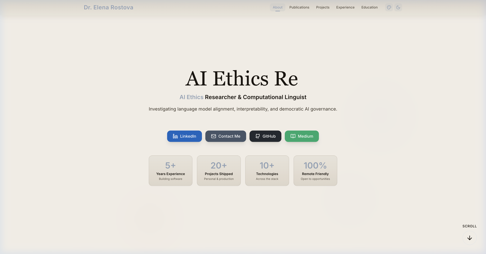

<div align="center">

# PortForge ⚡

### AI-Powered React Portfolio Builder

**Talk to an AI agent — paste your LinkedIn/resume or just answer a few questions — and get a production-ready portfolio in minutes.**

[](https://github.com/sritajkumarpatel/portforge/actions)
[](https://github.com/sritajkumarpatel/portforge/stargazers)
[](https://github.com/sritajkumarpatel/portforge/releases)
[](LICENSE)
[](CONTRIBUTING.md)
[](https://reactjs.org/)
[](https://vitejs.dev/)
[](https://tailwindcss.com/)
[](https://www.framer.com/motion/)

[Quick Start](#quick-start) · [Features](#features) · [Deploy](#deploy) · [Docs](AI_SETUP.md)

---

<!-- TODO: Add screen recording or GIF showing the agent building a portfolio in real time -->

</div>

## The Problem

You're a developer. You need a portfolio to get hired, land clients, or showcase your work. But:

- **Pre-built templates feel generic** — every React portfolio looks the same
- **Building from scratch takes weeks** — you'd rather spend that time on actual projects
- **CMS platforms are overkill** — drag-and-drop builders are slow, locked-in, and bloated
- **You keep putting it off** — months go by and your GitHub profile is still your only presence

## The Solution

PortForge is different. You don't build a portfolio — you **have a conversation** with an AI coding agent. It asks your name, then offers to speed things up with your LinkedIn export and/or resume (both optional — skip them and it'll just ask questions instead). Either way, it walks you through the rest, editing the data files in real time as you answer. Five minutes later, you have a fully personalized, production-ready portfolio website — built only from what you actually told it, nothing invented.

```
You: "Set up my portfolio"
Agent: "Hey! What's your name?"
You: "Alex Rivera"
Agent: "Want to paste your LinkedIn export or resume to speed this up? Totally optional."
You: "Sure — here it is..."
Agent: "Got it — 3 companies, 5 skill areas, no projects listed yet. Let's cover those, then pick a look."
... 5 minutes later ...
Agent: "Your portfolio is ready at ./my-portfolio/"
```

No account signup. No drag-and-drop. No CMS. Just your data + a React template + an AI agent.

## PortForge vs Building From Scratch

| | Self-built Portfolio | PortForge |
|---|---|---|
| **Setup time** | 2–4 weeks | 5 minutes |
| **Design uniqueness** | You design it (or copy someone) | 6 site structures × 5 visual styles × 7 color presets × custom hex |
| **Content structure** | Build it yourself | 8 pre-built sections + LinkedIn/resume import |
| **Animations & UX** | Hours of Framer Motion work | Scroll reveals, orbs, glass cards included |
| **SEO** | Manual meta tags, OG, JSON-LD | Built-in: Open Graph, Twitter Cards, sitemap |
| **Deployment** | Research + configure hosting | Netlify/Vercel/GitHub Pages configs included |
| **Maintenance** | You own every bug | Template updates via `git pull` |

## Features

### Content Sections (8 toggleable sections)

| Section | Description |
|---|---|
| **Hero** | Typewriter titles, floating orbs, social links, animated counters |
| **About** | Short bio, 2–3 paragraph full bio, 4 expertise pillars with capabilities |
| **Experience** | Timeline with companies, multiple roles per company, highlights, awards |
| **Skills / Tech Stack** | Collapsible expertise domains with categorized skills + brand icons |
| **Projects** | Card grid with featured flag, tech tags, GitHub + live demo links, detail modal |
| **Blog / Articles** | Medium articles with topic filtering (AI & LLM, Testing, Leadership, Development) |
| **Awards** | Gradient badge cards with company and year |
| **Certifications** | Grid with optional issuer logos and dates |
| **Education** | Cards with degree, institution, period, focus tags |

### Portfolio Structures

Not just a color swap — 6 genuinely different site shapes:

| Structure | What's different |
|---|---|
| **Scroll** (default) | One page, sections stacked, nav scrolls to each |
| **Bento** | Compact hero + a dashboard grid of section cards — click one to open it, nothing scrolls |
| **Case Study** | Projects lead immediately after the hero; everything else collapses into a secondary accordion |
| **Resume** | Same as Scroll but denser — no background animation, no highlights strip, tighter spacing |
| **Terminal** | A real simulated command-line shell (`help`, `about`, `projects`, `open <n>`, ...) instead of a webpage |
| **Multi-Page** | Separate routed pages (Home, Projects, Experience, ...) instead of one scrolling page |

### Visual Customization

- **5 visual styles** — Minimal (clean/professional), Bold (high contrast/dramatic), Terminal (monospace/CRT retro), Editorial (serif, calm, text-first), Brutalist (stark, raw, sharp-edged)
- **4 hero layouts** — center-profile, left-profile, full-image, text-only
- **3 navigation styles** — scroll, tabs, timeline
- **Describe-your-vibe mode** — skip the menus and just describe the look you want in your own words; the agent maps it to real settings and confirms before applying anything
- **7 color presets** — Slate-Amber, Indigo-Violet, Emerald-Teal, Rose-Fuchsia, Blue-Cyan, Slate-Cyan, Indigo-Amber
- **Custom colors** — any hex values for primary, accent, and background
- **Dark / Light mode** — toggleable, persisted to localStorage

### Animations & UX

- Framer Motion scroll-triggered fade-ups, parallax, floating gradient orbs, glass-morphism cards
- Sticky navigation with scroll progress indicator and active section tracking
- Back-to-top button, custom scrollbar, skeleton loading states
- Responsive design (mobile-first Tailwind)

### Developer Experience

- **LinkedIn & resume import** — paste either (or both) and the agent reads them itself and fills in real content; both are optional, and nothing is ever invented to fill a gap — it asks instead
- **SEO-ready** — Open Graph tags, Twitter Cards, JSON-LD structured data, sitemap.xml, robots.txt
- **One-command deploy** — GitHub Pages, Netlify, or Vercel with included configs
- **Zero lock-in** — plain React + Vite + JSON data files. Take it anywhere.

## Design Examples & Structures

PortForge builds genuinely different-looking sites, not just recolored templates — 6 portfolio structures × 5 visual styles × 7 color presets × custom hex, or just describe a vibe and let the agent configure it. Two real examples generated by PortForge:

| **Terminal Structure** | **Editorial Style** |
|:---:|:---:|
|  |  |
| *A real simulated command shell — `help`, `projects`, `open <n>`, all reading real content* | *Serif typography, calm paper palette, tabs navigation* |

<!-- More structures (bento, case-study, brutalist, multi-page, vibe-mode) — add screenshots to images/ and drop them in here as they're captured. -->

## Roadmap

Everything shipped so far is documented in [Features](#features) above — this is only what's next:

- [ ] Screen recording / GIF of the agent building a portfolio live (the screenshots above are static; a couple more structures still need capturing too — see the comment in [Design Examples](#design-examples--structures))
- [ ] Clean URLs for the multi-page structure (currently uses hash routing — `/#/projects` — to work on any static host with zero deploy config; a `BrowserRouter` option with the matching Netlify/Vercel/GitHub Pages redirect rules is a natural follow-up for anyone who wants clean paths instead)
- [ ] Data schema validation (JSON Schema or Zod) so a malformed `config.json`/data file fails fast with a clear error instead of a silent render bug
- [ ] Component unit tests (Vitest + Testing Library)
- [ ] VS Code extension for visual config editing

Have a suggestion? Open an issue or a discussion — see [Contributing](#contributing).

## Tech Stack

| Technology | Version | Purpose |
|---|---|---|
| **React** | 18 | UI framework |
| **Vite** | 5 | Build tool & dev server |
| **Tailwind CSS** | 3 | Utility-first styling |
| **Framer Motion** | 11 | Animations |
| **Lucide React** | 0.400 | Icons |
| **react-icons** | 5 | Brand / tech logos |
| **react-router-dom** | 6 | Routing for the multi-page structure |

## Quick Start

### Option 1: AI Agent Setup (Recommended)

```bash
git clone https://github.com/sritajkumarpatel/portforge.git
cd portforge
```

Open the repo (not the `template/` folder — the agent needs `AI_SETUP.md` alongside it) with your AI coding agent:

```bash
claude .
# or: opencode .
# or: code . (with Copilot Codex)

# Then say:
"Set up my portfolio"
```

In Claude Code specifically, you can also run **`/setup-portfolio`**.

The agent copies `template/` into its own project folder and walks you through every step from there — your clone of this repo is left untouched. No manual config required.

### Option 2: Manual Setup

```bash
cp -r template my-portfolio
cd my-portfolio
npm install
# Edit JSON files in src/data/ and src/config.json
npm run dev
```

## Project Structure

```
portforge/
├── AI_SETUP.md              # Agent orchestrator — entry point (the engine)
├── setup/                   # Step-by-step instructions the orchestrator hands off to
│   ├── content-schema.md    # What every JSON file needs, and where each field should come from
│   ├── 01-welcome-and-intake.md
│   ├── 02-extract-from-sources.md
│   ├── 03-manual-questions.md
│   ├── 04-design-preferences.md
│   └── 05-finalize.md
├── template/                # Portfolio template (copy this)
│   ├── public/
│   │   ├── robots.txt
│   │   └── sitemap.xml
│   ├── src/
│   │   ├── components/      # React components (Hero, About, Experience, etc.)
│   │   ├── structures/      # The 6 portfolio structures (scroll, bento, case-study, ...)
│   │   ├── themes/          # Visual style CSS (minimal/bold/terminal/editorial/brutalist)
│   │   ├── data/            # JSON content files (edit these)
│   │   ├── context/         # ThemeContext (dark/light, color presets)
│   │   ├── hooks/           # Shared hooks (e.g. useFocusTrap)
│   │   ├── config.json      # Central configuration
│   │   ├── App.jsx
│   │   └── index.css
│   ├── netlify.toml         # One-click Netlify deploy
│   ├── vercel.json          # One-click Vercel deploy
│   ├── vite.config.js
│   ├── tailwind.config.js
│   └── package.json
├── LICENSE
├── CONTRIBUTING.md
└── README.md
```

## Deploy

```bash
# GitHub Pages
npm run deploy

# Netlify — connect your repo, netlify.toml is included
# Vercel — connect your repo, vercel.json is included
```

Works the same regardless of which [portfolio structure](#portfolio-structures) you picked — including **multi-page**, which uses hash-based routing specifically so it needs no server-side rewrite rules on any of these hosts.

## Contributing

Contributions are welcome! Please read [CONTRIBUTING.md](CONTRIBUTING.md) before submitting a pull request.

1. Fork the repo
2. Create your feature branch (`git checkout -b feat/amazing-feature`)
3. Run `npx prettier --check .` to ensure formatting
4. Verify the template builds: `cd template && npm install && npm run build`
5. Open a Pull Request

## License

Distributed under the MIT License. See [LICENSE](LICENSE) for more information.

---

<p align="center">
Built by <a href="https://github.com/sritajkumarpatel">Sritaj Patel</a><br>
Designed for agentic setup — no hand-editing required.<br><br>
If PortForge saves you time, <a href="https://github.com/sritajkumarpatel/portforge">star the repo ⭐</a>
</p>
